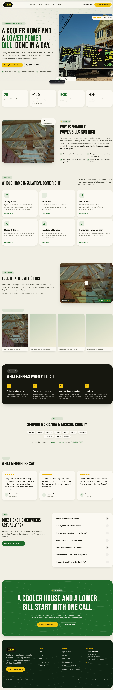

# A Plus Insulation — Website

Marketing and lead-generation site for **A Plus Insulation**, a family-run insulation
contractor in Marianna, Florida (Jackson County & the NW Florida Panhandle).

Built as a static site with **Astro + Tailwind CSS v4**. All customer-facing content
(copy, services, service area, SEO) lives in `src/data/site.ts`.

## Getting started

Requires **Node 20+**.

```bash
npm install      # install dependencies
npm run dev      # start the dev server at http://localhost:4321
```

Other commands:

```bash
npm run build    # build the static site to dist/
npm run preview  # preview the production build locally
```

## Pages

- **Home** — hero, trust points, process, cost table, FAQ
- **Services** — spray foam, blown-in, batt & roll, radiant barrier, removal, replacement
- **About** — the family, story, and commitments
- **Service Area** — interactive, real-geometry map of the counties served across FL, AL & GA
- **Contact** — free-estimate request

The service-area map geometry is projected from US Census county boundaries into
`src/data/panhandle-map.json`.

---

## Homepage


